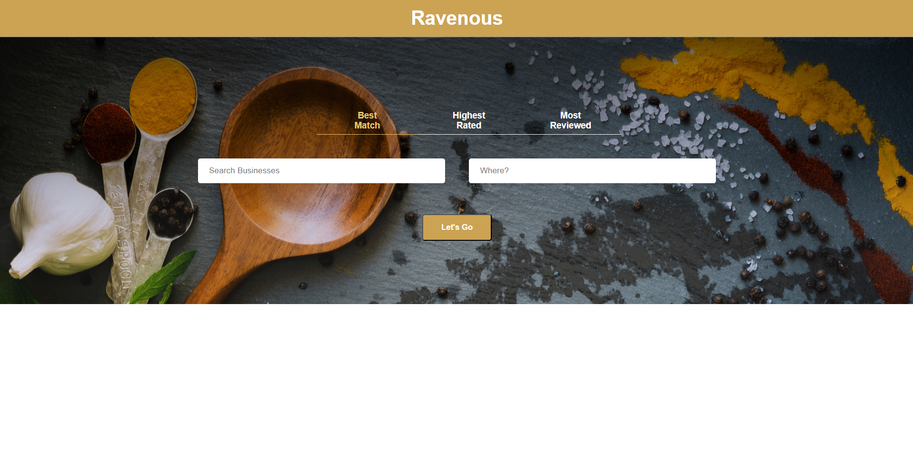

# Ravenous - About

A restaurant recommendation website that allows users to seach for businesses based on location and keywords. Replicates the core functionality of Yelp using the Yelp API. (Front-end app with React project via Codecademy.)

# Tech Stack

HTML, CSS, JavaScript, React, Yelp API

# Features

- Users can query for a restaurant based on a keyword and location, and sort it by best match, highest rated, and most reviewed.
- Users can view a list of businesses that match their query, sorted by best match, highest rated, or most reviews. The list is scrollable.
- Users can repeatedly make multiple queries for a restaurant recommendation.

# Future Work

- Improve styling, which was borrowed from a Codecademy solution to save time and focus on the functionality of the app and React
- Write test cases and perform additional testing of the site to check for bugs
- Add features such as loading animations and additional restaurant information (link to restaurant, etc.)
- Explore methods to hide API key

# Screenshots

This app was created with trial access to the Yelp API (https://docs.developer.yelp.com/docs/fusion-intro). To use the app, a new API key would need to be obtained and added to the Yelp.js file. Screenshots of the functioning app during the trial period are as follows:

Homepage

Mock Search

Mock Search - Sorted by Highest Rated

# CORS issue resolved via Codecademy instructions

If your fetch() method works as intended, you can skip this step. If you are seeing errors with your fetch() method, it may not be working properly due to CORS restrictions.

You can bypass this restriction with an API called CORS Anywhere. CORS Anywhere will take requests sent to its API endpoint, make them for the requesting app with the proper CORS permissions, and then return the response back to the requesting app.

In your own browser, visit https://cors-anywhere.herokuapp.com/corsdemo and click “Request temporary access to the demo server”

Back in your code, prepend the URL path you passed to the first argument in fetch() with the following:

https://cors-anywhere.herokuapp.com/

# Getting Started with Create React App

This project was bootstrapped with [Create React App](https://github.com/facebook/create-react-app).

## Available Scripts

In the project directory, you can run:

### `npm start`

Runs the app in the development mode.\
Open [http://localhost:3000](http://localhost:3000) to view it in your browser.

The page will reload when you make changes.\
You may also see any lint errors in the console.

### `npm test`

Launches the test runner in the interactive watch mode.\
See the section about [running tests](https://facebook.github.io/create-react-app/docs/running-tests) for more information.

### `npm run build`

Builds the app for production to the `build` folder.\
It correctly bundles React in production mode and optimizes the build for the best performance.

The build is minified and the filenames include the hashes.\
Your app is ready to be deployed!

See the section about [deployment](https://facebook.github.io/create-react-app/docs/deployment) for more information.

### `npm run eject`

**Note: this is a one-way operation. Once you `eject`, you can't go back!**

If you aren't satisfied with the build tool and configuration choices, you can `eject` at any time. This command will remove the single build dependency from your project.

Instead, it will copy all the configuration files and the transitive dependencies (webpack, Babel, ESLint, etc) right into your project so you have full control over them. All of the commands except `eject` will still work, but they will point to the copied scripts so you can tweak them. At this point you're on your own.

You don't have to ever use `eject`. The curated feature set is suitable for small and middle deployments, and you shouldn't feel obligated to use this feature. However we understand that this tool wouldn't be useful if you couldn't customize it when you are ready for it.

## Learn More

You can learn more in the [Create React App documentation](https://facebook.github.io/create-react-app/docs/getting-started).

To learn React, check out the [React documentation](https://reactjs.org/).

### Code Splitting

This section has moved here: [https://facebook.github.io/create-react-app/docs/code-splitting](https://facebook.github.io/create-react-app/docs/code-splitting)

### Analyzing the Bundle Size

This section has moved here: [https://facebook.github.io/create-react-app/docs/analyzing-the-bundle-size](https://facebook.github.io/create-react-app/docs/analyzing-the-bundle-size)

### Making a Progressive Web App

This section has moved here: [https://facebook.github.io/create-react-app/docs/making-a-progressive-web-app](https://facebook.github.io/create-react-app/docs/making-a-progressive-web-app)

### Advanced Configuration

This section has moved here: [https://facebook.github.io/create-react-app/docs/advanced-configuration](https://facebook.github.io/create-react-app/docs/advanced-configuration)

### Deployment

This section has moved here: [https://facebook.github.io/create-react-app/docs/deployment](https://facebook.github.io/create-react-app/docs/deployment)

### `npm run build` fails to minify

This section has moved here: [https://facebook.github.io/create-react-app/docs/troubleshooting#npm-run-build-fails-to-minify](https://facebook.github.io/create-react-app/docs/troubleshooting#npm-run-build-fails-to-minify)
